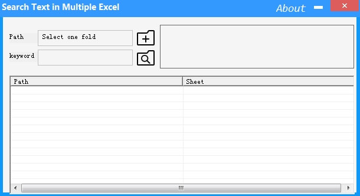

# Search-Text-in-Multiple-Excel
search text in multiple Excel files in Windows
###

### Handling several documents on your computer can often be a difficult task, especially when you want to identify a particular file among an outstanding amount of similar ones.

### However, specialized apps such as Search-Text-in-Multiple-Excel can help you with this task if you're trying to search an Excel file by its contents. It is worth mentioning that this application won't work unless you run it as an Administrator.

## Bulk search Excel files' contents
### If you want to perform a content search in a mass of Excel documents, then this tool is definitely for you. You simply need to select the folder that contains files you want to scan, set a keyword and hit the search button.
### Unfortunately, you can't add multiple folders or perform a drive scan. You need to limit your scans to a single folder at a time, which might be inconvenient to some users.

## Simple interface
### Search-Text-in-Multiple-Excel comes with a simplistic interface that encompasses a bunch of intuitive features, making it highly accessible even to novices.

### The main window consists of a couple of fields. One of them is used to define the folder you want to scan files in and the other one is used to type the keyword you're interested in. The side panel lets you view a list of identified Excel documents in the folder you specified, while the large one displays identified content.

## Portable tool
### This application doesn't require you to install it on the target computer as it is portable and simply decompressing the archive it comes packed in and launching the executable grants you total access to its functions.

### It doesn't create additional files or folders on your computer, nor does it tamper with your Windows registry entries. It can also be run from USB flash drives or external HDDs if needed.

## Lightweight bulk search tool for Excel documents
### All things considered, if you're looking for a way to perform searches in multiple Excel documents at the same time, you might want to consider using Search-Text-in-Multiple-Excel. It is lightweight, portable and packs a simplistic interface, making it ideal even for novices.

